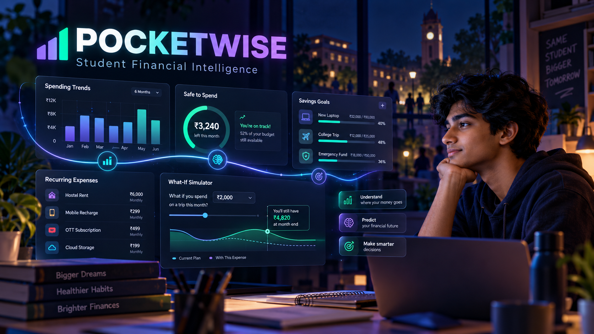
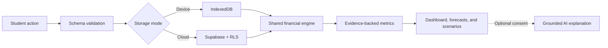

<div align="center">



<h1>Pocketwise</h1>

**An AI-powered personal financial intelligence system designed for students.**

Understand what changed, anticipate what comes next, and test financial decisions before spending.

[](https://react.dev/)
[](https://www.typescriptlang.org/)
[](https://vite.dev/)
[](https://supabase.com/)
[](#testing)

</div>

> The banner above is AI-generated concept artwork created specifically for Pocketwise. Values shown in it are illustrative; the application itself calculates every financial value from the user's actual or synthetic demo data.

## Why Pocketwise?

Most expense trackers stop at **“Here is what you spent.”** Pocketwise is built to answer the questions that matter next:

- **What changed?** Compare spending across meaningful periods.
- **Why did it change?** Trace changes to categories, merchants, frequency, and transaction size.
- **What is likely to happen?** Project month-end pressure using an explainable forecast.
- **Can I afford this?** Test a purchase against cash timing, budgets, and goals.
- **What should I do?** Receive focused actions backed by visible evidence.

It is not a chatbot wrapped around an expense table. Financial arithmetic stays deterministic and inspectable; optional AI is used only for language understanding and grounded explanations.

## Highlights

### Intelligent financial command center

The **Today** screen brings together estimated safe-to-spend, month-end projection, budget position, goal progress, upcoming commitments, and the most important changes in one responsive dashboard.

### Financial Digital Twin

Use **Try a decision** to simulate a purchase or spending change before committing money. Pocketwise compares the baseline with the scenario over 1, 3, 6, and 12 months and shows its effect on projected surplus and goals. Simulations never modify real transactions.

### Explainable insights

Every important insight can show its calculation period, comparison period, assumptions, method, and source transactions. Pocketwise describes measurable contribution rather than inventing behavioral causes.

### Student-specific planning

Model allowances, hostel costs, college fees, travel, subscriptions, academic expenses, emergency reserves, semester dates, and savings goals in one cash-flow view.

### Useful with or without cloud AI

Natural-language entry and common financial questions have deterministic support. Optional cloud AI expands language coverage and explanation quality, but totals, forecasts, budgets, and simulations never depend on an LLM.

### Privacy-conscious storage modes

- **Device mode:** no account required; records remain in IndexedDB in the current browser.
- **Cloud mode:** Supabase authentication, PostgreSQL persistence, and row-level ownership rules.
- **Demo mode:** a complete synthetic student story with no setup or API key.

## Feature map

| Area              | What Pocketwise provides                                                                                       |
| ----------------- | -------------------------------------------------------------------------------------------------------------- |
| Transactions      | Expense and income records, categories, merchant normalization, CSV import/export, and natural-language drafts |
| Analytics         | Period comparisons, category and merchant attribution, spending velocity, and evidence references              |
| Forecasting       | Commitment-aware month-end estimates with actual and projected values clearly separated                        |
| Smart budgets     | History-informed suggestions that remain proposals until the user accepts them                                 |
| Pattern detection | Unusual transaction review and recurring payment candidates with confirmation workflows                        |
| Financial health  | Explainable dimensions for budget adherence, saving consistency, recurring load, and upcoming pressure         |
| Planning          | Allowance, scheduled bills, goals, protected savings, and cash checkpoints                                     |
| Digital Twin      | Calculation-driven purchase and spending-change simulations across multiple horizons                           |
| Financial search  | Bounded questions answered from authorized records rather than invented transactions                           |
| Accessibility     | Responsive dark interface, keyboard-friendly controls, readable chart context, and reduced-motion support      |

## How it works



The shared TypeScript financial engine contains no React or database dependency. This keeps calculations consistent between local and cloud modes and makes the core logic straightforward to test.

## Technology

- **Interface:** React 19, TypeScript, React Router, Recharts, Lucide icons
- **Client data:** TanStack Query, Zod validation, Dexie/IndexedDB
- **Cloud:** Supabase Auth, PostgreSQL, Row Level Security, Edge Functions
- **Import:** Papa Parse with preview and validation
- **Tooling:** Vite, Vitest, Playwright
- **Deployment target:** Vercel frontend with optional Supabase services

## Run locally

### Prerequisites

- Node.js `20.19+` or `22.12+`
- npm

### Installation

```bash
git clone https://github.com/Ayush17goyal/SMART-EXPENSE-TRACKER.git
cd SMART-EXPENSE-TRACKER
npm install
npm run dev
```

Open [http://127.0.0.1:5173](http://127.0.0.1:5173).

Configure Supabase before signing up. Public authentication routes remain visible without configuration, but real accounts and protected financial storage require the Supabase project described below.

## Cloud configuration

1. Create separate development and production Supabase projects.
2. Review and apply both migrations in [`supabase/migrations`](supabase/migrations). The second migration enables public signup, profiles, and stronger ownership constraints.
3. Enable email confirmation and configure Google OAuth if desired in Supabase Auth.
4. Add the local and production callback/reset URLs listed in `.env.example` to the Supabase redirect allowlist.
5. Deploy the [`finance` Edge Function](supabase/functions/finance/index.ts) and configure `APP_ORIGINS` with comma-separated local and production origins.
6. Copy `.env.example` to `.env.local` and add the public Supabase values:
7. Before launch, configure Supabase Auth rate limits, SMTP delivery, CAPTCHA, password policy, and the production Site URL. Keep automatic identity linking limited to provider-verified email addresses.

```env
VITE_SUPABASE_URL=your-project-url
VITE_SUPABASE_ANON_KEY=your-anonymous-key
```

If optional AI explanations are enabled, keep `OPENAI_API_KEY` and `OPENAI_MODEL` in Supabase Function secrets. Never expose privileged credentials through a `VITE_*` variable.

## Demo walkthrough

1. Open the synthetic demo and review the projected month-end pressure.
2. Select **Why?** to inspect the spending change and its supporting records.
3. Review upcoming hostel, subscription, and travel commitments.
4. Open **Explore** and ask: `Can I afford to spend ₹2,000 this weekend?`
5. Use the Digital Twin to compare that purchase with a smaller amount or category reduction.
6. Review the impact over 1, 3, 6, and 12 months.
7. Add a goal in **Plan**, then return to **Today** to see the updated picture.

All demo values are calculated from seeded synthetic records; insight text is not hardcoded to fake an AI result.

## Testing

```bash
# Domain and calculation tests
npm test

# Production build and type checking
npm run build

# Browser tests (install Chromium once)
npx playwright install chromium
npm run test:e2e
```

Tests cover financial arithmetic, period boundaries, sparse data, forecasts, storage behavior, ownership expectations, and the primary browser experience.

## Security and privacy

- INR values are stored as integer paise to avoid floating-point accounting errors.
- Cloud ownership comes from the verified session, never a request-body user ID.
- Private cloud tables use row-level security.
- Inputs are validated before persistence or calculation.
- AI cannot generate SQL, access database credentials, or write financial records.
- Raw prompts, transactions, tokens, and account details are excluded from application logs.
- Export, restore, consent revocation, and account deletion paths are supported by the product architecture.
- Security headers are configured for production hosting.

Device storage is convenient but is not an encrypted vault and can be lost when browser data is cleared. Use the versioned export feature for recovery.

## Project structure

```text
src/
├── data/            Storage adapters and persistence
├── domain/          Financial engine, models, imports, and language parsing
├── views/           Today, Transactions, Plan, Explore, and Settings
├── components.tsx   Shared application components
├── styles.css       Dark responsive design system
└── animations.css   Motion with reduced-motion safeguards
supabase/
├── migrations/      PostgreSQL schema, indexes, and RLS
└── functions/       Authenticated finance orchestration
tests/e2e/           Playwright browser coverage
docs/images/         README and documentation artwork
```

## Product boundaries

Pocketwise deliberately avoids bank linking, SMS scraping, payment execution, investment advice, credit scoring, autonomous budget changes, and uncalibrated “AI risk percentages.” These features add privacy or accuracy risks without improving the core student decision workflow for the initial pilot.

## Roadmap

- [x] Core transactions, categories, budgets, goals, and local persistence
- [x] Explainable analytics and financial-health dimensions
- [x] Rule-based insights, recurrence candidates, and anomalies
- [x] Commitment-aware projections and safe-to-spend calculations
- [x] Financial Digital Twin and scenario comparison
- [x] Bounded financial questions and optional grounded AI explanations
- [x] Responsive dark interface and subtle motion
- [ ] Complete hosted Supabase pilot environment
- [ ] Calibrate forecasts with opt-in pilot data
- [ ] Expand coach workflows after calculation quality is validated

## Responsible use

Pocketwise provides educational budgeting support based on the records and assumptions supplied by the user. Forecasts are estimates, scenarios are hypothetical, and recorded surplus is not presented as guaranteed savings.

---

<div align="center">

Built to help students make informed decisions before money becomes stressful.

</div>
